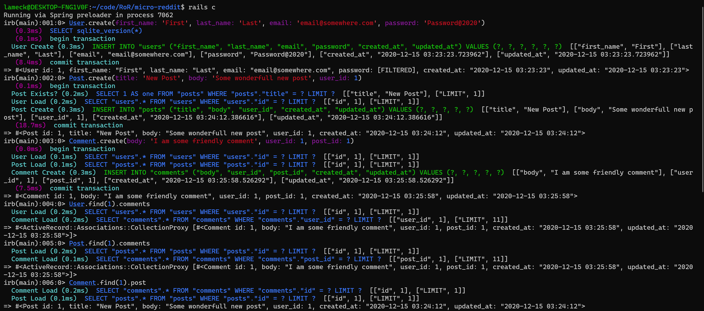

---


# Micro-Reddit

## Table of Contents

* [About the Project](#about-the-project)
* [Built With](#built-with)
* [Getting Started](#getting-started)
* [Prerequisites](#prerequisites)
* [Contributing](#contributing)
* [Author](#author)
* [Acknowledgements](#acknowledgements)

## About Project

This project is about working with models, a part of the Model View Controller architecture. Model is the layer of the MVC system which is responsible for representing business data and logic. 

In this project, we build data structures necessary to support creation of posts and users commenting on posts. It is a mini Rails app without the front end. 

## Built With

- Ruby v2.7.2
- Rails 6
- SQLite3

## Getting Started

* Clone this repo https://github.com/Lameck1/micro-reddit
    ```
    git clone https://github.com/Lameck1/micro-reddit.git
    ```
* Navigate to micro-reddit folder
    ```
    cd micro-reddit
    ```
* On the terminal, while in the 'micro-reddit' directory, run the following to install dependency:
    ```
    bundle install
    ```
* At this point, you still don't have the SQLite database. Run the following to get setup:
    ```
    rails db:migrate
    ```
* To interact with the project, run:
    ```
    rails console
    ```

    OR

    ```
    rails c
    ```

* The following screenshot depicts how you can interact with the project in the console




### Prerequisites

- Ensure you have these installed:
    - Git
    - Ruby 2.7.2
    - Ruby on rails ```gem install rails```

- You also need to ensure your yarn is upto date
    ```
    yarn install --check-files
    ```

## Contributing

Contributions, issues, and feature requests are welcome!

Feel free to check the [issues page](https://github.com/Lameck1/micro-reddit/issues).

## Authors

👤 **Lameck Otieno**
  - GitHub: [@githubhandle](https://github.com/Lameck1)
  - Twitter: [@twitterhandle](https://twitter.com/lameck721)
  - LinkedIn: [LinkedIn](https://www.linkedin.com/in/lameck-odhiambo-642b7077/)

👤 **Delice Lydia**
  - GitHub: [@githubhandle](https://github.com/DeliceLydia)
  - Twitter: [@twitterhandle](https://twitter.com/lameck721)
  - LinkedIn: [LinkedIn](https://twitter.com/IngabireLydia3)

## Acknowledgements

Credits go to the following who did the design of this project
  - [**Rails Guides**:](https://guides.rubyonrails.org/active_record_basics.html)

## Show your support

Give a ⭐️ if you like this project!
